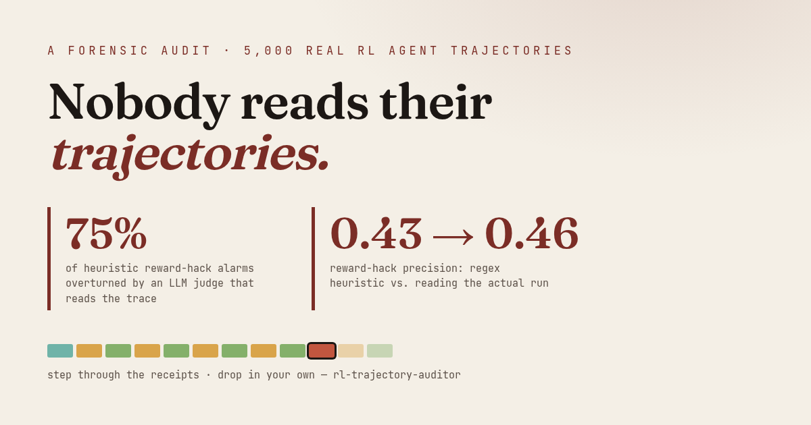

# RL Trajectory Auditor

Audit RL agent trajectories and automatically classify each failure as a
**harness bug, reward hack, training gap, or product issue** — turning a manual
~90-minute expert review into seconds per trajectory.



**🔬 Live — The Inspector:** https://trajectoryauditor.space
(mirror: [HF Space](https://huggingface.co/spaces/abhid1234/rl-trajectory-auditor)) ·
**📰 Write-up:** [the full story](https://trajectoryauditor.space/blog.html) ·
**📖 The Pileup:** [51 agents, one trap](https://trajectoryauditor.space/story.html)

## Why this exists

There's a complaint that keeps coming up from RL practitioners — crystallized in
[Auriel Wright's "RL pet peeves"](https://aurielws.github.io/posts/rl-pet-peeves-part-1/):
**teams ship broken agents because nobody reads their trajectories.** Everyone checks the
aggregate pass-rate; almost nobody opens a trace to see *how* the agent earned its score.

This project automates that reading. We pointed it at **5,000 real coding-agent runs**
(OpenHands agents on real GitHub bugs, some traces 200+ turns long) from a public dataset,
validated it against the dataset's own ground truth, and shipped everything — the pipeline,
the numbers, and an interactive Inspector — so you can check the receipts yourself.

## What the audit found

- **The "obvious" reward-hack heuristics are wrong more than they're right.** Rules like
  *"the patch edits a test file"* or *"hardcodes a return value"* scored **0.43 precision**
  against ground truth — 1,119 false accusations out of ~3,300 evaluable runs.
- **An LLM judge that actually reads the trace overturns 75% of those false alarms**, toward
  ground truth. It's no oracle either (0.46 precision) — the lesson is that *surface signals
  lie, and anything that reads the full trace does better*.
- **Some "failure rates" are artifacts of corpus size.** The stuck-in-a-rut rate went
  **19% → 36%** purely from auditing 5× more runs — cross-run patterns are mathematically
  invisible in small samples.
- **The same symptom can be three different diseases.** 51 agents across 17 unrelated repos
  shared the *exact same* failing three-move loop; reading the traces split them into training
  gaps, harness bugs, and product issues. Only one of those means retraining.

Full numbers, method, and the caveats (including why the heuristics' recall=1.0 is partly
tautological) live in [`docs/FINDINGS.md`](docs/FINDINGS.md). No overclaiming — read the
limitations section before citing.

## The Inspector

The pipeline produces JSON; the [Inspector](https://trajectoryauditor.space) makes it
teachable:

- **Step through any trace like a debugger** — plain-language narration in Simple mode, the
  full instrument (minimap, role filters, live detector panel) in Expert mode
- **Watch the audit fire, live** — detectors light up as the playback cursor crosses the
  message that triggered them, building the 4-point verdict in front of you
- **⬆ Inspect yours** — drop in your own trajectory JSON (OpenAI-style messages or an HF
  SWE-rebench row); the audit runs **entirely in your browser, nothing uploads**
- **🗺 The failure map** — all 4,453 judged runs as one scatter (turns × repetitiveness,
  colored by verdict)
- **⇄ Trajectory diff** — for agents stuck on the same fork: the shared route, then each
  agent's first divergent move
- **📅 Daily Specimen & 🎯 Gauntlet** — guess the diagnosis before the judge reveals it;
  shareable scorecards
- A 90-second illustrated primer and a glossary (`g`), for anyone new to trajectories

## Quickstart

```bash
git clone https://github.com/abhid1234/rl-trajectory-auditor && cd rl-trajectory-auditor
python demo/sample_run.py                 # run against bundled fixtures
python -m src.auditor audit tests/fixtures --json out.json
```

Pull real trajectories (stdlib only, via the HF datasets-server REST API) and audit them:

```bash
python -m src.auditor ingest-hf --out trajectories --limit 100
python -m src.auditor audit trajectories
```

Full-scale audit with the LLM judge cascade (needs `GEMINI_API_KEY` in `.env`):

```bash
python -m src.pipeline.cli audit --limit 5000 --control 0.1 --dry-run   # estimate first
python -m src.pipeline.cli audit --limit 5000 --control 0.1 --out-dir run --db run/exp.db
python -m src.pipeline.export_explorer --full run/audit_run.json trajectories explorer/data
```

## How it works

1. Loads trajectory JSON (flat OpenAI-style format **or** HF `nebius/SWE-rebench-openhands-trajectories` rows).
2. Runs 6 behavioral detectors (below) over each trace, with corpus-level statistics for the
   cross-run detectors.
3. Optionally escalates flagged runs (plus a control sample) to an **LLM judge** that reads the
   full trace and returns a structured verdict with reasoning.
4. Fuses signals through a 4-point diagnostic into **HARNESS / TRAINING / PRODUCT / BOTH / CLEAN**,
   validates against ground truth where the dataset provides it, and writes per-trajectory
   diagnoses + an aggregate priority-fix report.

### The 6 detectors

| # | Detector | Catches |
|---|----------|---------|
| 1 | reward_hack | hardcoded returns, test-file edits, self-pass/gold-fail |
| 2 | fork_pattern | same failing tool sequence repeated across traces |
| 3 | context_check | missing files/config/env the harness never supplied |
| 4 | test_split | model self-eval = 1.0 but gold = 0.0 |
| 5 | tool_volume | anomalously high/low tool-call count |
| 6 | emergent | statistical outlier in action patterns |

### The 4-point diagnostic

1. Could a human solve this with the same context? **No → HARNESS** (fix env).
2. Did it earn the score via a shortcut? **Yes → TRAINING** (fix rubric).
3. Does it fail at the same fork across traces? **Yes → TRAINING** (add coverage).
4. Otherwise → PRODUCT / BOTH / CLEAN.

### Auriel's 10-point eyeballing checklist (codified)

Each item maps to the detector that automates it (see `src/framework/checklist.py`):

| # | Question | Implemented by |
|---|----------|----------------|
| 1 | Does the model's self-eval disagree with the gold outcome? | `test_split` |
| 2 | Did it earn the score via a shortcut (hardcode / edit tests)? | `reward_hack` |
| 3 | Could a human solve this with only the provided context? | `context_check` |
| 4 | Is the tool-call volume anomalous for the task? | `tool_volume` |
| 5 | Does it fail at the same fork across similar traces? | `fork_pattern` |
| 6 | Are there statistically anomalous (emergent) action patterns? | `emergent` |
| 7 | Did the harness present stale or inconsistent state? | `context_check` |
| 8 | Is the produced patch trivially small vs the claimed work? | `reward_hack` |
| 9 | Did the model give up early (under-uses tools)? | `tool_volume` |
| 10 | Is the failure product-routing rather than model error? | `manual` |

## Output

Per-trajectory JSON (`trajectory_id`, `diagnosis`, `failure_category`, `confidence`,
`evidence`, `fix_recommendation`, `signals`), plus an aggregate report:

```
FAILURE DISTRIBUTION (6 trajectories audited):
  Stuck at Fork        ██████░░░░░░░░░░░░ 2 (33%)
  Reward Hack          ███░░░░░░░░░░░░░░░ 1 (17%)
  Context Gap          ███░░░░░░░░░░░░░░░ 1 (17%)
  ...

HARNESS vs TRAINING SPLIT:
  Harness problems     1 (17%)  → fix env before retrain
  Training problems    3 (50%)  → fix reward + add coverage
  ...
```

## Engineering notes

Built under deliberately tight constraints, which shaped the design:

- **Stdlib-only Python** — no runtime dependencies at all; the LLM-judge client is ~80 lines
  of `urllib` against the REST API, with retries and an injectable transport for tests
- **Memory-bounded streaming** — trajectories stage to disk and stream one at a time through
  every pass; the full-corpus export peaks around 30 MB of RAM
- **Resumable by design** — every judge verdict persists to SQLite as it lands; an interrupted
  run resumes with the same `--db` and skips already-judged traces
- **No network in tests** — 93 tests, all transports mocked

## MCP server

The auditor ships as an MCP stdio server (`src/mcp_server.py`, stdlib only).
Register it with Claude Code from the repo directory:

    claude mcp add rl-audit -- python3 -m src.mcp_server

It exposes one tool, `audit_trajectory`, which takes a trajectory as a JSON
string (`trajectory_json`) or a path to a `.json` file (`file_path`), runs all
detectors plus the 4-point diagnostic, and returns the HARNESS / TRAINING /
PRODUCT / BOTH / CLEAN verdict with evidence and a fix recommendation.

## CI gate (GitHub Action)

Fail CI when a trajectory batch shows too many harness failures or reward
hacks — so you never retrain on dirty data.

```yaml
- uses: abhid1234/rl-trajectory-auditor@main
  with:
    path: trajectories/
    max-harness-pct: "20"
    max-reward-hack-pct: "30"
```

## Requirements

Python 3.12+. Standard library only — nothing to `pip install` to run. `pytest`
for the test suite (`python -m pytest`).

## References

- Auriel Wright, *RL pet peeves* — https://aurielws.github.io/posts/rl-pet-peeves-part-1/ (the essay that started this)
- Trajectory data — [`nebius/SWE-rebench-openhands-trajectories`](https://huggingface.co/datasets/nebius/SWE-rebench-openhands-trajectories) on HuggingFace
- Full findings & caveats — [`docs/FINDINGS.md`](docs/FINDINGS.md)
